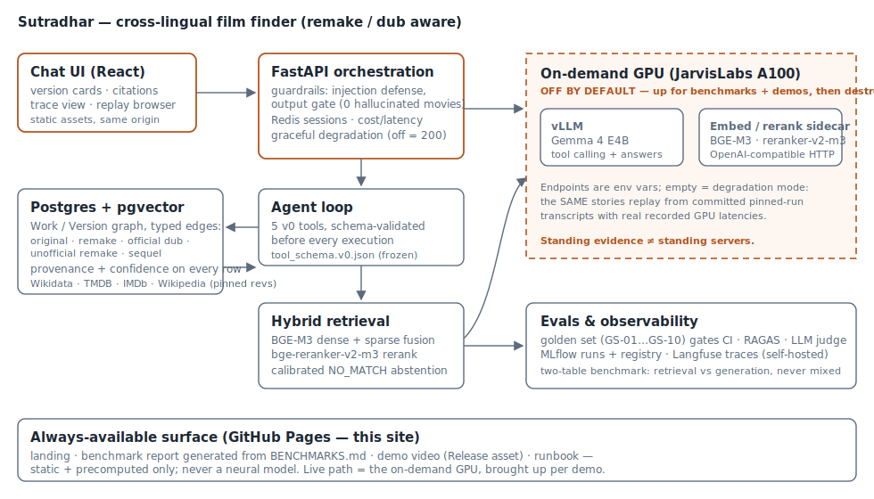

# Sutradhar

[](https://github.com/venkathub/sutradhar-film-finder/actions/workflows/tier1.yml)
[](https://github.com/venkathub/sutradhar-film-finder/actions/workflows/pages.yml)


> A multilingual assistant, built to production standards, that finds an Indian film from its story, plot, or cast — cross-lingual remake/dub aware.

Ask about **Papanasam** (Tamil) and Sutradhar knows the original is **Drishyam** (Malayalam), surfacing **all** language versions — the original plus every remake and official dub — with the original clearly flagged and every claim grounded in a cited source.

## Results at a glance

| Signal | Value | Where |
|---|---|---|
| Retrieval Recall@10 (gold suite) | **1.0** | sealed artifacts in `evals/`, recomputed by CI |
| Version Surfacing Rate (remake families) | **1.0** | `docs/BENCHMARKS.md` |
| Prompt-injection attack success rate | **0.000** (static suite) | `evals/injection_runs/` |
| LLM-judge validation | κ = 0.738 (same-rater re-validation) | `docs/BENCHMARKS.md` |
| QLoRA adapter vs prompted base | **CUT** — base won 2/3 primary metrics, pre-registered rule | honest negative result |
| Demo | one command, zero GPU: `make demo-up` | replays pinned GPU transcripts |



## The hard problem

Cross-lingual entity resolution across **remakes** and **dubs**. The same story exists as separate
films with separate casts across languages (remake) **and** as the same film with replaced audio
(dub) — different relationships that must not be conflated. The worked example that gates the build:

```
Drishyam (2013, Malayalam, Mohanlal) = ORIGINAL
  ├─ Drishya   (2014, Kannada)
  ├─ Drushyam  (2014, Telugu,   Venkatesh)
  ├─ Papanasam (2015, Tamil,    Kamal Haasan)
  └─ Drishyam  (2015, Hindi,    Ajay Devgn)
```

Any correct answer to a Papanasam query must return the Malayalam original plus all four Indian
remakes, labelled by relationship. Queries arrive code-mixed (Hinglish/Tanglish) and in native
scripts; titles match across scripts via transliteration.

## Architecture: hybrid, not pure fine-tuning

Fine-tuning teaches **behaviour and format**, not facts. The catalog and remake graph are
frequently-updated factual data, so they live in **retrieval**, never in weights.

- **RAG owns the facts** — catalog, remake/dub graph, grounding, citations.
- **QLoRA owns the behaviour** — code-mixed intent parsing, slot extraction, multi-turn
  backtracking, tool-calling, answering in the user's language/register.

The rule was: if QLoRA does not measurably beat a well-prompted base model on the generation
metrics, we cut it and document why. **Settled (2026-07-04): verdict CUT under the pre-registered
rule ([DEC-P4-9](./docs/DECISIONS.md))** — the served model is the **well-prompted base**; the
adapter + dataset remain published for provenance. The negative result is part of the portfolio.

## Subsystems

1. **Chat UI** — find-a-movie chat; shows all language versions with the original flagged; renders citations and a trace view.
2. **API layer (FastAPI)** — orchestration, guardrails, caching, token/cost/latency tracking.
3. **RAG Engine** — query normalization + transliteration, hybrid retrieval (BGE-M3 dense + sparse), cross-encoder reranking (bge-reranker-v2-m3), grounding, prompt-injection guardrails.
4. **Catalog + Remake-Graph store** — Postgres modelling canonical Work nodes and per-language Version nodes with typed edges; embeddings in pgvector or Qdrant.
5. **Conversation/Intent model** — the well-prompted base Gemma 4 E4B (DEC-0001; QLoRA adapter trained and **CUT** under the pre-registered verdict, DEC-P4-9).
6. **Serving** — vLLM on a rented GPU, brought up **on-demand** for demo/benchmark, then stopped.

Cross-cutting: **Evals & Observability** (RAGAS + Langfuse + MLflow), CI-gated.

## Repo layout

| Path | Purpose |
|------|---------|
| `/data-pipeline` | Ingestion (TMDB/Wikidata/IMDb), remake-graph build, transliteration/normalize |
| `/finetune` | Synthetic data gen, QLoRA training, merge; optional GGUF quantize |
| `/rag-engine` | Embeddings, hybrid retrieval, reranker, grounding, guardrails |
| `/serving` | FastAPI app + vLLM serving adapter |
| `/evals` | RAGAS harness, golden test set, two-table benchmark runner |
| `/ui` | Chat + trace view |
| `/infra` | Docker, docker-compose, CI |
| `/docs` | ROADMAP, DECISIONS, RUNBOOK, BENCHMARKS, LICENSING, PORTFOLIO, DATA_SOURCES, GOLDEN_SET_SCENARIOS |

### Directory → import package

The `CLAUDE.md` subsystem directories are hyphenated and are **not** valid import names. All Python
code lives in one installable package, `sutradhar` (under `src/`, per `docs/DECISIONS.md` DEC-P0-2);
the hyphenated top-level dirs hold entrypoint scripts, Dockerfiles, and READMEs that import from
`sutradhar.*`. Directory name ≠ import name by design.

| Directory | Import package |
|-----------|----------------|
| `data-pipeline` | `sutradhar.pipeline` |
| `rag-engine` | `sutradhar.rag` |
| `serving` | `sutradhar.serving` |
| `finetune` | `sutradhar.finetune` |
| `evals` | `sutradhar.evals` |
| `infra` | — (containers / CI; no import package) |
| `ui` | — (frontend assets; no import package) |

## Cost discipline (a first-class feature)

Nothing inference-side runs 24/7. The GPU is rented (never owned), brought up only to capture the
benchmark and for live interview demos, then stopped. The standing portfolio evidence is the
**documented benchmark** from the live GPU run — not a live endpoint.

## Quickstart

Fresh clone → running stack in one command each (task runner is `make`; see `make help`):

```bash
cp .env.example .env       # fill HF_TOKEN etc. as needed; no secret goes in git
make setup                 # uv sync — install the locked environment
make up                    # start Postgres(+pgvector) + Redis, wait for healthy
make smoke                 # LLM connectivity: token if the GPU is up, graceful "endpoint OFF" if not
make hf-check              # verify Hugging Face auth (whoami)
make down                  # stop the stack
```

**30-second demo:** `make up && make smoke` shows the live stack and the graceful endpoint-OFF
message (the default — the on-demand GPU is normally paused).

| Target | Purpose |
|--------|---------|
| `demo-up` / `demo-down` | **THE 30-second demo**: fresh clone → containerized stack → seeded graph → chat UI at `:8080`, zero GPU |
| `setup` | `uv sync` the locked env |
| `fmt` / `lint` / `typecheck` | ruff format / ruff check / mypy (strict) |
| `test` / `test-int` | unit tests / integration tests (needs `make up`) |
| `check` | Tier-1 gate: lint + typecheck + unit tests |
| `up` / `down` / `down-v` | compose stack up / down / down + drop volume |
| `ui-build` / `ui-dev` / `ui-test` / `ui-e2e` | build the chat UI / dev server / component tests / the 8 Playwright golden regressions |
| `site-build` | generate the static portfolio surface (benchmark page from BENCHMARKS.md) |
| `gpu-serve` / `gpu-stop` / `gpu-nuke` | on-demand GPU serve window / stop / stray-instance safety |
| `smoke` / `hf-check` | LLM connectivity smoke / HF auth check |

## Status

**P0–P6 complete — the system is finished and demonstrable.** Thirty seconds, zero GPU:

```bash
git clone <repo> && cd sutradhar && make demo-up   # → http://localhost:8080/
```

The UI comes up **offline by design** (the GPU is on-demand, never 24/7) and replays the
recorded Papanasam story — version cards with the original flagged, per-claim citations,
the tool-call trace — from pinned benchmark transcripts with real GPU latencies. The live
experience is one `make gpu-serve` away (rehearsed: 545 s cold bring-up, $0.21/window,
teardown verified — [`docs/RUNBOOK.md`](./docs/RUNBOOK.md)).

What each phase proved (details: [`docs/PORTFOLIO.md`](./docs/PORTFOLIO.md), numbers:
[`docs/BENCHMARKS.md`](./docs/BENCHMARKS.md), every choice: [`docs/DECISIONS.md`](./docs/DECISIONS.md)):

- **P1 — the remake graph:** verified cross-lingual Work/Version graph (typed edges:
  original / remake / official dub / unofficial remake / sequel), per-claim provenance +
  confidence gates, human-gated LLM edge extraction.
- **P2 — hybrid retrieval:** BGE-M3 dense+sparse fusion + reranker; **Recall@10 = 1.0,
  version-set recall 1.0** (incl. Papanasam→Drishyam) on the golden set; calibrated
  NO_MATCH abstention; GPU-free CI evals from pinned artifacts.
- **P3 — eval harness:** golden generation fixtures, tool-call scoring, LLM-judge
  governance (κ-validated), RAGAS, MLflow + self-hosted Langfuse.
- **P4 — QLoRA fine-tune, the honest negative:** trained, benchmarked base-vs-adapter
  under a pre-committed keep/cut rule → **CUT** (the well-prompted base won); adapter +
  dataset published for provenance.
- **P5 — the served path:** FastAPI orchestration with layered injection defense
  (**live ASR 0.000** on the static suite — bounded claim, not adaptive robustness;
  **served-layer** hallucinated-movie rate 0 via the deterministic output gate, while the
  **model layer** honestly recorded **GS-02 = 1 ⚠ on both Table 2 columns** — the gate, not
  the model, holds the zero),
  Redis sessions, cost accounting, graceful degradation (GPU off = structured 200).
- **P6 — product + packaging:** the chat UI (version cards, citations, trace view,
  replay browser), one-command containerized demo (CI-proven from a fresh checkout),
  8 Playwright golden regressions on the rendered DOM, the
  [always-available static surface](https://venkathub.github.io/sutradhar-film-finder/),
  and the rehearsed, timed live-demo runbook.

## Why the demo works despite base tool-call accuracy 0.083

Table 2 records the honest number: the well-prompted 4B base scores **0.083 (1/12)** on strict
BFCL-style full-sequence tool-call accuracy. So why does the served demo answer correctly? Because
the product was engineered to not depend on that number:

- **Deterministic orchestration** — the API layer, not the model, owns the control flow: query
  normalization → retrieval → grounding → cited answer. The model orchestrates *within* a loop
  whose steps are validated, retried with structured feedback, and bounded.
- **Schema-validated tool loop** — every emitted call is validated against the frozen
  [`tool_schema.v0.json`](./docs/phases/tool_schema.v0.json) *before execution*; hallucinated
  tools/parameters are caught, fed back, and scored — they never execute. The strict metric counts
  a conversation as failed if *any* step needed feedback; the loop recovers most of them.
- **The output gate** — every asserted title is fuzzy-grounded against this conversation's actual
  tool results; inventions are rewritten to `[unverified]` or disclaimed
  (`sutradhar.serving.guardrails.output_gate`). Faithfulness is enforced at the boundary, not
  hoped for from the weights.

That layering is the point: a 4B model with an honest 0.083 strict score still ships a grounded,
cited, non-hallucinating product — and the number stays published because the evidence, not the
optics, is the portfolio.

**The cost story is a feature:** nothing inference-side runs 24/7. Every neural workload
ran in short, teardown-verified on-demand GPU windows; the standing evidence (benchmarks,
pinned transcripts, MLflow runs, screenshots, this repo) carries the proof while every
model server is off.

See [`CLAUDE.md`](./CLAUDE.md) for the full engineering operating agreement and [`docs/`](./docs)
for data sourcing, decisions, and golden-set scenarios.

## Licensing

Data sources carry mixed licenses (IMDb non-commercial, Wikidata CC0, TMDB developer terms,
Wikipedia CC BY-SA 4.0 — revision-pinned). This is a **non-commercial portfolio project**; the
UI renders the required attribution chrome (enforced by an executable test). See
[`docs/LICENSING.md`](./docs/LICENSING.md) and [`docs/DATA_SOURCES.md`](./docs/DATA_SOURCES.md).
